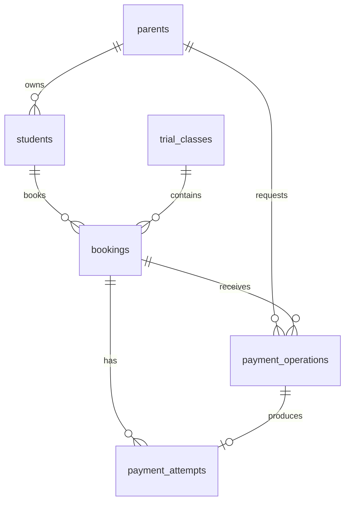

# Ottodot — Trial Booking Reliability

A trial class booking system with mock payments, built for the Ottodot Full-Stack Engineer take-home.

Trial classes hold **exactly 4 confirmed students**. The interesting part of this problem is not the CRUD — it is what happens when two parents fight over the last seat, when a payment fails, when a response is lost in transit, and when someone double-clicks. This implementation puts a single PostgreSQL transaction with a class-row lock at the centre of every path that can create a confirmed booking, and proves the behaviour with automated tests that use genuinely concurrent database connections.

**Scope:** trial booking only. Regular enrollment is not implemented.

---

## Table of contents

- [What I built](#what-i-built)
- [Quick start](#quick-start)
- [Seed data and edge cases](#seed-data-and-edge-cases)
- [Verification](#verification)
- [Backend design](#backend-design)
- [The last-seat race](#the-last-seat-race)
- [Where each check lives](#where-each-check-lives)
- [Time spent](#time-spent)
- [Assumptions](#assumptions)
- [What I deliberately cut](#what-i-deliberately-cut)
- [What I would monitor after release](#what-i-would-monitor-after-release)
- [What I would do next](#what-i-would-do-next)

---

## What I built

A full-stack Next.js application, backend-led, with a real PostgreSQL database as the single source of truth.

| Layer | What exists |
| ----- | ----------- |
| Database | 6 tables, 6 enums, 2 migrations, 4 raw-SQL constraints Prisma cannot express |
| Backend | 7 service functions, 8 HTTP Route Handlers, Zod validation, typed domain errors |
| Frontend | 3 pages — booking flow, booking detail with mock payment, teacher roster |
| Tests | 34 automated tests (13 unit + 21 integration) covering all 18 acceptance scenarios |
| Tooling | Seed, demo reset (CLI **and** in-app button), standalone invariant verifier |

**The parent flow:** pick a demo profile → pick a child → pick a trial class → create booking (`pending_payment`) → run a simulated payment → read the stored result. Refreshing the page or restarting the server never changes the answer, because the answer lives in Postgres.

**The teacher flow:** pick a class → see confirmed participants, capacity usage, and each booking reference. Only `confirmed` bookings appear. Pending and failed bookings never leak into the roster.

**Screens are functional, not decorative.** The brief says polish is not required, and I did not treat it as a grading criterion — but the three screens do carry real state: disabled controls for full classes, an explicit "seat not guaranteed yet" disclaimer, a live capacity bar, a payment panel that *disappears* (not merely disables) once a booking reaches a terminal state, and an unknown-outcome recovery path.

---

## Quick start

**Requirements:** Node.js 24+, Docker, npm.

```bash
npm ci
```

```bash
cp .env.example .env
```

The defaults in `.env.example` match the Docker container created in the next step — no editing needed for local development.

```bash
npm run db:up
```

This starts a `postgres:16` container named `ottodot-postgres` on port **5433** (deliberately not 5432, so it will not collide with a Postgres you may already be running) with a database named `ottodot`.

```bash
npm run db:migrate:deploy
```

```bash
npm run db:seed
```

```bash
npm run dev
```

Open <http://localhost:3000>.

- `/` — booking flow (parent)
- `/teacher` — class roster
- `/bookings/<id>` — booking status and mock payment (you land here after creating a booking)

**Resetting the demo.** Manual testing mutates the fixture data. Two ways to get back to a known state:

```bash
npm run demo:reset
```

…or click **Reset demo data** in the top navigation bar of the running app. Both run the same transaction and both are limited to the fixture rows — neither uses `TRUNCATE`, and neither touches data outside the two seeded classes. The in-app button calls `POST /api/demo/reset`, which is gated behind `DEMO_MODE=true`.

> I verified this exact setup sequence from scratch — fresh container, fresh database, `migrate deploy`, `seed`, invariant check, and the full integration suite — before writing these instructions.

### Environment variables

| Variable | Purpose | Notes |
| -------- | ------- | ----- |
| `DATABASE_URL` | Prisma runtime connection | Required. Server-only; never exposed to the browser |
| `DIRECT_URL` | Connection used by `prisma migrate` | Same as `DATABASE_URL` locally; a direct (non-pooled) URL when targeting Supabase |
| `DEMO_MODE` | Enables the synthetic demo endpoints | Must be the literal string `true` — it never defaults on |

`.env` and every other `.env*` file except `.env.example` are gitignored. No credentials are committed anywhere in this repository.

### Other commands

| Command | What it does |
| ------- | ------------ |
| `npm run typecheck` | `tsc --noEmit` |
| `npm run lint` | ESLint, no auto-fix |
| `npm run build` | Production build |
| `npm test` | Unit tests |
| `npm run test:integration` | Integration tests against the real local database |
| `npm run verify:invariants` | Runs 4 invariant queries; exits non-zero on any violation |
| `npm run demo:reset` | Restores fixture data to its initial state |

---

## Seed data and edge cases

`npm run db:seed` creates 3 parents, 6 students, 2 trial classes, and 4 bookings. Every case the brief asks to be demonstrable is present in the initial data:

| Fixture | State | Demonstrates |
| ------- | ----- | ------------ |
| **Math Trial** (`AVAILABLE`) | 0 confirmed, 4 seats free, starts in ~14 days | A class with available seats — happy path, failure, retry |
| **Science Trial** (`LAST_SEAT`) | **Exactly 3 confirmed**, 1 seat free, starts in ~15 days | The last-seat race |
| Seed Child 1, 2, 3 | Confirmed on Science Trial, each with a consistent successful attempt | The "exactly 3 confirmed" precondition |
| Child A2 | Has a `payment_failed` booking + failed attempt on Math Trial | A payment failure case, and retry from a failed state |
| Child A (Parent A) / Child B (Parent B) | No booking on Science Trial | Two competing users for the last seat |
| Any seeded child re-submitted to their existing class | — | A duplicate booking attempt |

The seed deliberately does **not** create two confirmed bookings for the same child–class pair "to illustrate duplicates". A duplicate is demonstrated by *attempting* one and watching the system return the same canonical booking instead of creating a second.

**To watch the last-seat race by hand:** open two browser tabs. In tab 1 select Parent A → Child A → Science Trial and create a booking. In tab 2 select Parent B → Child B → Science Trial and create a booking. Both are now `pending_payment` and both see 1 seat free. Pay successfully in tab 2 → confirmed, roster is 4. Now pay in tab 1 → `seat_unavailable`, and the payment attempt is recorded as `not_processed` / `class_full`. No mock charge succeeded for the loser. (The demo profile is stored per browser tab in `sessionStorage`, which is what makes two-tab testing work.)

---

## Verification

```bash
npm run test              # 13 passed
npm run test:integration  # 21 passed
npm run verify:invariants # 4 invariant queries, all clean
npm run typecheck && npm run lint && npm run build  # all clean
```

All results above are actual output from the final commit, not aspirations.

### What the tests actually prove

The integration tests run against a **real PostgreSQL database** through the real service layer. They are not mocked at the function boundary, because a mock cannot prove that a row lock works.

All 18 acceptance scenarios are automated:

| File | Scenarios |
| ---- | --------- |
| `tests/integration/booking-lifecycle.test.ts` | AT-01…AT-05 — create, confirm, fail, reuse, parallel create |
| `tests/integration/concurrency.test.ts` | AT-06, AT-07 — sequential last-seat, and the true concurrency barrier |
| `tests/integration/replay-and-validation.test.ts` | AT-08…AT-12, AT-16…AT-18 — replay, two keys on one booking, retry, mixed-status roster, invalid input, persistence, started/full classes |
| `tests/integration/rollback-and-lost-response.test.ts` | AT-13…AT-15 — stale UI snapshot, lost response, mid-transaction rollback |
| `tests/unit/*.test.ts` | Zod contracts, HTTP result vs. transport-error mapping, client recovery state machine |

Each integration test builds its own fixtures with random UUIDs and cleans up only its own rows, so tests never touch the demo data a reviewer is looking at.

### The concurrency test is genuinely concurrent

This is the part I care most about, and the part that took the longest to get right.

`AT-07` sets up a class with 3 confirmed bookings and two pending bookings for different children, then:

1. A **separate OS process** opens a transaction and takes `SELECT … FOR UPDATE` on the class row, holding it.
2. Two independent `PrismaClient` instances (separate connection pools) call `finalizeMockPayment` concurrently, both requesting a successful mock payment. Both block on the class lock.
3. The guard process commits, releasing the lock.
4. Both workers proceed and are asserted: **exactly one** `confirmed` and **exactly one** `class_full`; exactly one new `succeeded` attempt and one `not_processed`; final roster exactly 4.

**Why a separate process:** my first implementation held the guard lock from a raw `pg.Client` in the same Node process as the Prisma workers, and the workers *did not block* — verified from an independent third connection via `pg_locks`, where the Prisma worker showed `granted: true` immediately. A test that passes because nothing actually contended proves nothing. Moving the guard into a real child process via `child_process.spawn` fixed it, and the workers' measured wait time now matches the guard's hold duration.

Two sequential clicks are **not** evidence of race safety. This test is.

---

## Backend design

### Data model

Six tables in the `public` schema. UUID primary keys, `timestamptz` for all times, PostgreSQL enums for every status, `ON DELETE RESTRICT` on every foreign key.



| Table | Key columns | Purpose |
| ----- | ----------- | ------- |
| `parents` | `id`, `display_name` | Synthetic demo profiles |
| `students` | `id`, `parent_id`, `display_name` | Ownership is derived from this relation — bookings do not duplicate `parent_id` |
| `trial_classes` | `id`, `title`, `subject`, `starts_at`, `capacity`, `price`, `currency` | `capacity` is CHECK-constrained to exactly 4; price is an integer (no floats) |
| `bookings` | `id`, `student_id`, `trial_class_id`, `status`, `confirmed_at` | **`UNIQUE(student_id, trial_class_id)`** — one canonical booking per child–class pair |
| `payment_operations` | `operation_id` (PK), `parent_id`, `booking_id`, `requested_outcome`, `result_code` | The idempotency ledger. One row per operation ID, globally unique, immutable |
| `payment_attempts` | `id`, `booking_id`, `operation_id` (UNIQUE), `result`, `reason`, `amount`, `currency` | Payment history. At most one attempt per operation |

**There is no roster table, no seat counter, and no cache.** The roster *is* the set of confirmed bookings, and `available_seats = capacity − confirmed_count`, computed on read. A denormalised counter would be a second source of truth that can drift from the first; with a dataset this size there is no reason to accept that risk.

**Four constraints are raw SQL** in the migration, because Prisma's schema language cannot express CHECK constraints or partial unique indexes:

```sql
-- At most one successful payment per booking
CREATE UNIQUE INDEX payment_attempts_one_success
  ON payment_attempts (booking_id) WHERE result = 'succeeded';

-- confirmed_at is set if and only if status = 'confirmed'
ALTER TABLE bookings ADD CONSTRAINT bookings_confirmed_at_matches_status
  CHECK ((status = 'confirmed') = (confirmed_at IS NOT NULL));

-- An attempt's reason must match its result
ALTER TABLE payment_attempts ADD CONSTRAINT payment_attempts_reason_matches_result
  CHECK (
       (result = 'succeeded'     AND reason IS NULL)
    OR (result = 'failed'        AND reason = 'mock_declined')
    OR (result = 'not_processed' AND reason = 'class_full')
  );

-- Class data sanity
ALTER TABLE trial_classes ADD CONSTRAINT trial_classes_capacity_fixed CHECK (capacity = 4);
ALTER TABLE trial_classes ADD CONSTRAINT trial_classes_price_positive CHECK (price > 0);
```

There is also a composite foreign key from `payment_attempts (operation_id, booking_id)` to `payment_operations (operation_id, booking_id)`, so an attempt physically cannot point at another booking's operation receipt.

**What constraints deliberately do not do:** the capacity limit of 4 is *not* a database constraint. Enforcing it declaratively would require a CHECK that counts other rows, which PostgreSQL does not support safely. Capacity is enforced by the finalisation transaction, and `verify:invariants` independently audits that the enforcement actually held.

### Booking statuses

| Status | Meaning | In roster? | What the user can do next |
| ------ | ------- | ---------- | ------------------------- |
| `pending_payment` | Booking recorded; no successful payment yet | No | Run the simulated payment |
| `confirmed` | Mock payment succeeded and the seat is allocated | **Yes** | View details — terminal |
| `payment_failed` | A processed payment attempt failed | No | Retry payment, or pick another class |
| `seat_unavailable` | Finalisation rejected — the class filled up before the charge | No | Pick another class — terminal |

`confirmed` and `seat_unavailable` are terminal. There is no cancellation in v1, so a seat is never released, which means a `seat_unavailable` booking never needs to be retried.

Payment attempts have their own result vocabulary, which is deliberately *not* the same as booking status:

| Attempt result | Reason | Means |
| -------------- | ------ | ----- |
| `succeeded` | `NULL` | The mock charge succeeded and the booking was confirmed in the same transaction |
| `failed` | `mock_declined` | The simulator was asked for failure, and the class had room — a real business failure |
| `not_processed` | `class_full` | The class was full. **No mock charge was ever run.** |

That third row is the important one. A full class does not produce a "failed payment" — it produces a payment that was never attempted. The distinction is preserved all the way to the UI.

And the operation ledger records a fifth vocabulary — the outcome of the *operation*, so replays can be answered without re-running anything: `confirmed`, `payment_failed`, `class_full`, `already_confirmed`, `already_unavailable`.

### Backend functions

`src/lib/server/booking-service.ts` exports seven functions. Route Handlers never touch Prisma directly.

| Function | Transaction? | Purpose |
| -------- | ------------ | ------- |
| `listDemoParents(db)` | read-only | Demo profiles |
| `listStudents(db, parentId)` | read-only | Children of one profile |
| `listTrialClasses(db, includeStarted?)` | read-only | Classes with `confirmed_count`, `available_seats`, `is_bookable` |
| `getBookingDetail(db, parentId, bookingId)` | read-only | Booking + student + class + full attempt history |
| `getClassRoster(db, trialClassId)` | read-only | Class + confirmed students |
| `createBooking(db, parentId, studentId, trialClassId)` | **yes** | Create-or-reuse the canonical booking |
| `finalizeMockPayment(db, parentId, bookingId, operationId, requestedOutcome)` | **yes** | The one path that can produce a confirmed booking |

The database client is passed in as a parameter rather than imported as a module singleton. That is what lets integration tests hand in two independent clients to create real contention — and it also sidesteps the fact that Next.js's `server-only` package cannot be resolved by the Vitest/tsx runtime.

### API endpoints

| Method & path | Input | Success |
| ------------- | ----- | ------- |
| `GET /api/demo/parents` | — | 200, demo profiles |
| `GET /api/students` | `X-Demo-Parent-Id` header | 200, that profile's children |
| `GET /api/trial-classes` | optional `?include_started=true` | 200, classes with availability |
| `POST /api/bookings` | header + `{ student_id, trial_class_id }` | **201** new, **200** reuse |
| `GET /api/bookings/:id` | header | 200, booking detail |
| `POST /api/bookings/:id/payment` | header + `Idempotency-Key` + `{ outcome }` | see table below |
| `GET /api/trial-classes/:id/roster` | — | 200, class + confirmed students |
| `POST /api/demo/reset` | — (gated by `DEMO_MODE`) | 200, fixtures restored |

Every response uses the same envelope: `{ data, error, request_id }` with `Cache-Control: no-store`. Request bodies are validated with **strict** Zod schemas — a client that tries to smuggle in `amount`, `capacity`, `status`, or `parent_id` gets a 400, it does not get those fields silently ignored. The charged amount always comes from the locked class row, never from the request.

**Finalisation returns business results as data, not as errors:**

| `result_code` | HTTP | New attempt | Booking becomes |
| ------------- | ---- | ----------- | --------------- |
| `confirmed` | 200 | `succeeded` | `confirmed` |
| `payment_failed` | **402** | `failed` | `payment_failed` |
| `class_full` | **409** | `not_processed` | `seat_unavailable` |
| `already_confirmed` | 200 | none | stays `confirmed` |
| `already_unavailable` | 409 | none | stays `seat_unavailable` |

A 402 or 409 here carries `error: null` and a full result body. The client checks `body.error === null`, **not** the HTTP status, to decide whether a request succeeded — because "your simulated payment declined" is a successful API call reporting a business outcome, not a transport failure.

Genuine errors, which carry no business result, use a separate vocabulary: `INVALID_REQUEST` (400), `DEMO_CONTEXT_REQUIRED` (400), `NOT_FOUND` (404), `CLASS_FULL` (409, create only), `CLASS_STARTED` (409), `IDEMPOTENCY_CONFLICT` (409), `DATABASE_BUSY` (503), `RESULT_UNKNOWN` (503), `INTERNAL_ERROR` (500), `DEMO_DISABLED` (404). PostgreSQL `55P03` (lock timeout) and `40P01` (deadlock) map to `DATABASE_BUSY` — an unexpected constraint violation maps to `INTERNAL_ERROR` and is logged. It is never disguised as a failed payment.

### How duplicate bookings are prevented

Three layers, deliberately redundant:

1. **Database:** `UNIQUE(student_id, trial_class_id)`. This is the real guarantee. Even a direct SQL insert cannot create a second booking for the same pair.
2. **Transaction:** `createBooking` takes the class row lock *before* looking for an existing booking, so two simultaneous submissions for the same child and class serialise. The second one finds the first one's booking and returns it.
3. **Semantics:** a repeat submission is not an error. It returns the existing booking with `created: false` and HTTP 200 instead of 201. Status, `created_at`, and `updated_at` are **not** reset — including when the existing booking is already `confirmed` on a class that has since filled up.

I deliberately avoided `upsert` here. An upsert that writes `status: pending_payment` on conflict would silently downgrade a confirmed booking back to pending — the exact class of bug this table's uniqueness is supposed to prevent.

Duplicate *payments* are a different problem, solved by the operation ledger (below).

### How payment failure is handled

A failed mock payment is a **recorded business outcome**, not an exception:

- A `failed` attempt row is written with reason `mock_declined`.
- The booking becomes `payment_failed`.
- Capacity and the roster are untouched — a failed payment never consumed a seat.
- All of this **commits**. The function returns normally.

That last point is not cosmetic. If the code threw an exception to signal "payment failed", the exception would roll back the very rows recording that the payment failed. Exceptions are reserved for validation rejections that must leave no trace, idempotency conflicts, and genuine technical faults that *should* roll back.

Retrying from `payment_failed` reuses the same booking and creates a new attempt with a new operation ID. The failed history is never deleted — a booking can legitimately end up with two failed attempts and one successful one.

Network failures are treated as a third thing entirely, distinct from both success and failure: `RESULT_UNKNOWN`. The client keeps the operation ID it already sent, moves to an `outcome_unknown` state offering only "Check result" (a replay of the *same* key), and refuses to mint a new key until the outcome of the old one is known. A lost response must never be assumed to mean the payment failed.

### Idempotency

Every finalisation carries a client-generated UUID in the `Idempotency-Key` header. It is stored in `payment_operations`, globally unique across the whole table — not scoped per booking, and not per tab.

The key is bound to `(operation_id, parent_id, booking_id, requested_outcome)`. Same key, same inputs → the stored result is replayed with no second effect. Same key, different inputs → `IDEMPOTENCY_CONFLICT`, no mutation, and no leaking of the other operation's contents.

The key is claimed with:

```sql
INSERT INTO payment_operations (...) VALUES (...)
ON CONFLICT (operation_id) DO NOTHING
RETURNING operation_id
```

**Not** by catching Prisma's `P2002`. In PostgreSQL a constraint violation aborts the entire transaction; catching the error in application code does not recover it without a savepoint, and Prisma does not create one. Catching `P2002` here would poison the transaction and every subsequent statement would fail with `25P02`. This one is easy to get wrong and its failure mode is confusing, which is why it is called out here.

**Replay is not a frozen snapshot.** If key K1 failed, then key K2 succeeded, then K1 is re-sent: K1's stored `result_code` stays `payment_failed` and its attempt stays `failed` — but the response carries the *current* booking, which is `confirmed`. The guarantee is "no second business effect and the same operation result", not "byte-identical response". The UI always renders `booking.status`, so a late replay of an old failure can never make a confirmed booking look failed.

---

## The last-seat race

> User A takes the last slot and moves to payment. User B takes the same slot. B pays first and confirms. A then tries to pay.

**Required outcome: at most one confirmed booking for that seat.** Here is how that is guaranteed.

### The approach

Every finalisation runs inside a **single interactive PostgreSQL transaction** at `READ COMMITTED`, and the first thing it does is take a row-level write lock on the *class*:

```sql
SET LOCAL lock_timeout = '3s';
SELECT … FROM trial_classes WHERE id = $1 FOR UPDATE;
```

Lock order is fixed and never varies: **class → booking → operation ID claim**. One transaction handles one class, one booking, one key.

Only *after* holding the class lock does the transaction count confirmed bookings, decide the outcome, write the operation receipt, write the payment attempt, and update the booking status. All of it commits together, or none of it does.

```mermaid
sequenceDiagram
    participant A as User A
    participant DB as PostgreSQL
    participant B as User B
    Note over DB: Science Trial — 3 confirmed, 1 seat free
    B->>DB: BEGIN; SELECT class FOR UPDATE
    Note over DB: B holds the class lock
    A->>DB: BEGIN; SELECT class FOR UPDATE
    Note over A,DB: A blocks — waits for B
    B->>DB: COUNT confirmed = 3 → seat available
    B->>DB: attempt succeeded + booking confirmed
    B->>DB: COMMIT
    Note over DB: 4 confirmed
    Note over A,DB: A acquires the lock, re-counts
    A->>DB: COUNT confirmed = 4 → full
    A->>DB: attempt not_processed/class_full + seat_unavailable
    A->>DB: COMMIT
    Note over DB: still 4 confirmed — invariant held
```

The count is always taken **after** the lock is held, never before, and never from the browser's snapshot. A's page may still be showing "1 seat left" — that snapshot is advisory only and the backend re-decides from scratch.

Crucially, A gets `not_processed`, not `failed`. **No mock charge is ever executed for a full class.** Capacity is checked before the simulated payment runs, so there is no world in which money is "taken" for a seat that does not exist.

### Why this approach

**Why lock the class row rather than the booking row?** Because the contention is over the class's capacity, and the competing users have *different* bookings. Locking each user's own booking row would serialise nothing — both would proceed in parallel, both would count 3, and both would confirm. The class row is the single object all competitors share, so it is the correct thing to serialise on. Different classes remain fully parallel; only finalisations for the *same* class queue up.

**Why not a `SERIALIZABLE` transaction?** It would also be correct, but it moves the failure into a retry loop on serialisation failures, which is more machinery and a worse error story for the same guarantee at this scale. `READ COMMITTED` plus an explicit lock is easier to read, easier to reason about, and easier to prove in a test.

**Why not a counter column with an atomic `UPDATE … SET seats = seats - 1 WHERE seats > 0`?** That works, but it creates a second source of truth that can drift from the booking rows. Then "how many people are actually in this class" has two possible answers. Counting confirmed bookings under a lock has exactly one.

**Why not a seat hold?** Because it would need expiry, release, and a background job to clean up abandoned holds — real machinery, out of proportion to this scope. The cost of not having one is stated below and is visible in the UI.

**Why an application-level transaction rather than a database function?** The logic is more readable and reviewable in TypeScript, and it is directly testable. The tradeoff is honest: the protection covers the application path. A DBA running raw SQL bypasses it — which is exactly why `verify:invariants` exists as an independent audit rather than as an assumption.

### Tradeoffs I accepted

| Tradeoff | Consequence | Why it is acceptable here |
| -------- | ----------- | ------------------------- |
| No seat hold | User A can lose the seat while sitting on the payment screen | The UI says explicitly that availability is a snapshot and the seat is only guaranteed after payment. Holds need expiry + release + a worker |
| Class-level lock | Finalisations for the same class serialise | Capacity is 4. Contention is inherently tiny. Different classes never block each other |
| Application-enforced capacity | Direct SQL writes could violate it | Independent invariant queries audit it; a real deployment would not expose the database |
| Mock payment inside the DB transaction | Does not model a real gateway | Called out below — a real charge cannot be rolled back by a database rollback |
| `pending` does not consume capacity | Many users can hold pending bookings for one seat | Prevents abandoned bookings from starving a class with no expiry mechanism |

**The honest limit of the mock:** the simulated payment succeeds or fails *inside* the same database transaction as the booking update, which is why they are perfectly atomic. A real payment provider is a separate system — rolling back the local transaction would not un-charge the customer. Real integration needs provider-side idempotency keys, webhook verification, out-of-order and duplicate event handling, reconciliation, and compensating refunds. Those are a different design, not a bigger version of this one.

---

## Where each check lives

| Layer | Responsibility | Explicitly *not* responsible for |
| ----- | -------------- | -------------------------------- |
| **UI** | Selection, completeness checks, loading state, disabling buttons during a request, showing that a seat is not guaranteed, rendering stored status | Any correctness guarantee. Every disabled button can be bypassed with `curl`, and the backend is safe when it is |
| **Backend** | Demo-context validation, ownership checks, strict Zod parsing, sourcing the amount from the class row, operation-ID lifecycle, transaction boundaries, mapping results to HTTP | Being the last line of defence for uniqueness — the database is |
| **Database** | Persistence, referential integrity, canonical-booking uniqueness, one-success-per-booking, `confirmed_at`/status consistency, result/reason consistency, row locking, transaction atomicity | Capacity — that needs the transaction, since a CHECK cannot count other rows |
| **Background job** | **Nothing. There is no job.** | Not needed without seat holds, expiry, webhooks, or reconciliation. If real payments arrive, webhook retry and reconciliation land here first |

The layering is deliberately redundant where it is cheap. The Route Handler validates the *shape* of `X-Demo-Parent-Id`; the service then validates actual ownership against database relations — and in `finalizeMockPayment` it validates ownership a second time, after taking the booking lock, on the freshly re-read row. That header is forgeable demo context, not authentication, so nothing downstream is allowed to trust it on its own.

---

## Time spent

**4 hours** — 8 September 2026, 00:00 to 04:00 SGT (7 September 23:00 to 8 September 03:00 WIB / UTC+7).

| Phase | Approx. |
| ----- | ------- |
| Syncing the architecture notes to the decisions made in the design interview | 20 min |
| Scaffold, Prisma, local Postgres, env, scripts | 15 min |
| Schema, migrations, raw SQL constraints, seed, `createBooking`, `finalizeMockPayment` | 55 min |
| Integration tests AT-01…AT-18, including debugging the concurrency harness | 85 min |
| Route Handlers, three pages, unit tests | 45 min |
| UI iteration, final verification, docs | 45 min |

That fits inside the brief's 4-hour cap. The first drafts of the requirements and architecture notes were written before the clock started; the 20-minute block above is the cost of reconciling them with the decisions that came out of the design interview, and it is counted.

**Where the time actually went:** the largest single block was not writing the concurrency test — it was discovering that my first version of it *was not actually concurrent*, and rebuilding the harness around a separate OS process. Diagnosing that consumed roughly 40 minutes and produced no shipped feature, only the confidence that the headline claim of this project is true.

---

## Assumptions

1. **Payments are simulated end to end.** No gateway, no card fields, no money. Every payment control in the UI is labelled as a simulation.
2. **The demo profile picker is not authentication.** `X-Demo-Parent-Id` is forgeable context that makes two-user scenarios demonstrable in two tabs. Ownership is enforced by database relations, not by trusting the header — but nothing here proves the identity of a real person, and it must not be mistaken for a login.
3. **The database is not reachable from the internet.** The only path to it is the application server. There is no Data API or PostgREST layer, so row-level security is not a defence in this design — the real boundary is connection-string secrecy plus backend validation. I would rather state that plainly than claim protection that is not configured.
4. **Pending bookings do not hold seats and never expire.** An abandoned pending booking costs nothing and blocks nobody.
5. **One canonical booking per child–class pair, for the entire lifecycle.** Retries reuse it. This is a simplification: the brief only requires uniqueness of *confirmed* bookings. It would need revisiting if cancellation and rebooking were added.
6. **A child may book several different classes.** No once-per-lifetime trial rule, no per-subject limit, no schedule-conflict detection.
7. **Confirmed is final in v1.** No cancellation, refund, or downgrade.
8. **Demo pricing is a flat SGD 50 per child per class,** stored as an integer with no floating point. This is a demo figure, not an Ottodot price.
9. **Class times are displayed in WIB (Asia/Jakarta)** while the demo currency is SGD. That mix is an artefact of the demo dataset, not a modelling claim; times are stored absolute (`timestamptz`) and only formatted for display.
10. **The UI is in English**, while internal status identifiers are also English (`pending_payment`, `seat_unavailable`, …) and are never translated — they are contract values, not user copy.
11. **Two environments, identical schema.** Local Docker Postgres for development and tests; Supabase is the intended managed Postgres for a hosted demo, used purely as a database via Prisma — no Supabase Auth, Realtime, Storage, or Edge Functions. Migrations keep them in sync. The application has not been deployed; the brief asks for a repository and a video, not a live URL.
12. **Integration tests only ever target the local database** and build their own randomly-identified fixtures, so running them never disturbs demo data.

---

## What I deliberately cut

Cuts, in the order I would restore them:

| Cut | Why |
| --- | --- |
| Real payment gateway | Out of scope by the brief. Needs its own reliability design, not a bigger mock |
| Authentication and authorisation | Demo profiles are enough to demonstrate multi-user scenarios; real auth is a separate concern |
| Seat holds, expiry, waitlists | Needs a background worker and release logic. The UX cost is disclosed to the user instead |
| Cancellation, reschedule, changing the child on a booking | Would require rethinking the "one canonical booking forever" model |
| CRUD for parents, children, classes | Data arrives via seed; management screens prove nothing about the invariants under test |
| Realtime roster updates | Manual refresh is sufficient and easier to verify |
| Age/grade eligibility, trial-per-lifetime limits, schedule-conflict checks | Business rules the brief does not ask for |
| Email, WhatsApp, reminders, calendar integration | Not part of the booking-correctness problem |
| Pagination, search, filtering | The fixture dataset is tiny |
| Deployment | Repository + video are the deliverables; a live URL is not required |
| A "parent account" column and per-student attendance checkboxes in the roster | The roster API does not carry parent identity, and there is no attendance feature. I would rather ship a smaller true table than a wider one with invented columns |

**What I refused to cut,** even when the clock was tight: the class row lock, canonical-booking uniqueness, the operation ledger, mock-payment/booking consistency, the raw-SQL constraints, and a concurrency proof that genuinely overlaps. Those are the brief.

---

## What I would monitor after release

No dashboard is built. These are the signals I would put in place, and what each one would mean:

| Signal | Interpretation |
| ------ | -------------- |
| **Confirmed bookings per class > 4** | Critical. The core invariant is broken; audit every write path immediately. This is `verify:invariants` query 1, and it should run on a schedule, not just in CI |
| **Duplicate child–class bookings** | Critical. Either the unique index is gone or something bypassed the service layer |
| **`confirmed` without exactly one successful attempt** (or vice versa) | Transactional inconsistency between booking and payment records |
| **`class_full` rejections after a user reached the payment screen** | The measurable UX cost of having no seat hold. If this climbs, holds become worth building |
| **Payment failure and retry rates** | Meaningless for a mock, essential the moment payments are real |
| **Finalisation latency, lock waits, `lock_timeout`, deadlocks** | Contention health. Rising lock waits on one class would be the first sign that per-class serialisation has become a bottleneck |
| **`IDEMPOTENCY_CONFLICT` frequency** | Distinguishes normal transport retries from clients misusing operation IDs |
| **`RESULT_UNKNOWN` responses** | How often users land in the ambiguous-outcome path and whether they successfully recover from it |
| **Long-abandoned pending bookings** | Data hygiene only — they hold no seats |

Diagnostic logs correlate `request_id`, `booking_id`, `trial_class_id`, `operation_id`, `result_code`, `replayed`, duration, HTTP status, and the database error code. Connection strings, authorization headers, and SQL are never logged, and children's names are not needed to investigate a transaction.

I would not set numeric alert thresholds yet. There is no production traffic to derive them from, and inventing SLOs that were never agreed would be worse than admitting the numbers do not exist.

---

## What I would do next

With more time, in priority order:

1. **A load test against the class lock.** Not 2 concurrent finalisations, but 50, to see contention behaviour and confirm `lock_timeout` is tuned sensibly.
2. **Real payment integration**, designed properly: provider idempotency keys, webhook signature verification, out-of-order and duplicate event handling, an outbox for effects that must survive a rollback, reconciliation, and compensating refunds. This is the change that would most alter the current architecture, because the atomicity the mock enjoys disappears.
3. **Authentication**, replacing the demo header with real sessions, plus per-teacher class authorisation before any real student data exists.
4. **Seat holds** — if the monitoring above shows users frequently losing seats at the payment step. Timed hold, explicit release, expiry worker, and capacity counted as confirmed + unexpired holds.
5. **Cancellation and rebooking**, which means revisiting the one-canonical-booking model and adding seat release — which in turn feeds back into the race logic and would need its own concurrency tests.
6. **Structured logging and metrics export**, so the signals above become queryable instead of theoretical.
7. **CI** running typecheck, lint, build, both test suites, and `verify:invariants` against a service-container Postgres on every pull request.
8. **Accessibility audit** — keyboard paths and `aria-live` announcements were built in deliberately but have only been checked manually, never with a screen reader.

---

## Repository layout

```text
prisma/
  schema.prisma            6 models, 6 enums
  migrations/              2 migrations, incl. raw SQL constraints
  seed.ts, fixtures.ts     Synthetic demo data
scripts/
  reset-demo.ts            Restore fixtures (also exposed as POST /api/demo/reset)
  verify-invariants.ts     4 independent audit queries
src/
  app/
    page.tsx               Booking flow
    bookings/[id]/page.tsx Status + mock payment
    teacher/page.tsx       Roster
    api/                   8 Route Handlers
  lib/
    contracts.ts           Public domain types
    validation.ts          Zod schemas
    client/                Fetch wrapper, payment recovery state machine
    server/
      booking-service.ts   The 7 functions — all business logic
      prisma.ts            server-only client singleton
      demo-context.ts      Demo profile header handling
      errors.ts            DomainError + database error mapping
      http.ts              Response envelopes
tests/
  unit/                    13 tests
  integration/             21 tests, AT-01…AT-18
  helpers/                 Fixtures, env loading, cross-process lock guard
```
